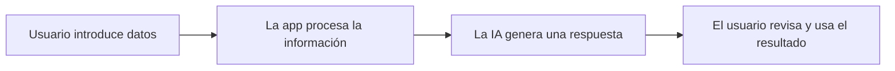

# Skill: Memoria de Proyecto IA — Informe Ejecutivo

## Objetivo

Generar una **Memoria de Proyecto + Informe Ejecutivo completo** a partir de la información que el alumno proporcione sobre su proyecto.

El documento debe:

- Cubrir las 9 fases principales del enunciado.
- Narrar el proceso de trabajo real: qué prompts usó, en qué se inspiró, qué herramientas empleó, qué decisiones tomó y por qué.
- Incluir ejemplos concretos de inputs y outputs reales o representativos del prototipo.
- Ser comprensible para una persona no técnica.
- Ser entregable directamente como Markdown, web HTML/CSS, DOCX, PDF o presentación, según permita el entorno.
- Tener una extensión orientativa equivalente a 12-20 páginas A4, aproximadamente entre 4.600 y 8.000 palabras si se genera como memoria completa.

---

## Cuándo usar este skill

Usa este skill cuando el alumno pida:

- Una memoria de proyecto.
- Un informe ejecutivo.
- Un documento final de entrega.
- Un PDF del proyecto.
- Una presentación de defensa.
- Una estructura formal para documentar su app, web o PWA.
- Una memoria académica basada en un prototipo creado con IA.
- Una versión documentada de su proceso de Vibe Coding con Google Antigravity.

También úsalo si el alumno describe su proyecto y pide ayuda para convertirlo en una entrega completa.

---

## Cuándo NO usar este skill

No uses este skill si el alumno solo pide:

- Ideas iniciales de proyecto.
- Una lluvia de ideas.
- Ayuda puntual con código.
- Resolver un bug.
- Diseñar una pantalla concreta.
- Explicar una herramienta técnica.
- Mejorar un prompt aislado.
- Crear una funcionalidad sin documentar la memoria completa.

En esos casos, ayuda primero con la tarea concreta. Si después el alumno quiere documentar el proyecto completo, activa este skill.

---

# Paso 1 — Recopilar información del alumno

Antes de generar el informe final, obtén los datos del proyecto mediante una **entrevista estructurada**.

Haz las preguntas en bloques, no todas a la vez. Adapta el tono: cercano, directo y sin jerga innecesaria.

Si el alumno ya ha compartido parte de esta información en la conversación, extráela directamente sin volver a preguntar. Solo haz las preguntas que falten.

---

## Bloque A — El problema y el contexto

Pregunta:

1. ¿Qué problema detectaste? ¿En qué tipo de empresa, entidad o entorno ocurre?
2. ¿Es un caso real o ficticio? ¿Tiene nombre la empresa, entidad o proyecto?
3. ¿Cuándo aparece ese problema y con qué frecuencia?
4. ¿A quién afecta más directamente?

---

## Bloque B — El proceso y el coste

Pregunta:

5. ¿Cuál es el proceso concreto que quisiste mejorar?  
   Ejemplos: gestión de citas, respuesta a emails, fichas de producto, presupuestos, atención al cliente, clasificación de solicitudes.
6. ¿Tienes algún dato de cuánto tiempo o dinero consume ese proceso? Puede ser estimado.
7. ¿Qué pasaría si no se resuelve el problema?

---

## Bloque C — La solución diseñada

Pregunta:

8. ¿Qué nombre le pusiste a tu solución o app?
9. ¿Qué hace exactamente? ¿Qué introduce el usuario y qué recibe como resultado?
10. ¿Usaste Google Antigravity? ¿Cómo se llama el prototipo y dónde está publicado?
11. ¿Qué herramientas técnicas usaste?  
    Ejemplos: HTML, CSS, JavaScript, GitHub Pages, APIs, Google Antigravity, Firebase, Supabase, etc.

---

## Bloque D — El proceso de trabajo

Este bloque es clave para que la memoria no parezca una plantilla rellenada.

Pregunta:

12. ¿Qué prompts usaste para construir la solución? Pide que pegue alguno o que los resuma.
13. ¿En qué te inspiraste? ¿Viste algún ejemplo, referencia, plantilla, app o proyecto similar?
14. ¿Qué fue lo más difícil?
15. ¿Qué tuviste que cambiar, repetir o corregir durante el desarrollo?
16. ¿Qué resultado obtuviste en las pruebas?  
    Ejemplos: número de casos probados, aciertos, errores, tiempo ahorrado, mejoras detectadas.

---

## Bloque E — Riesgos y entrega

Pregunta:

17. ¿Qué riesgos identificaste al usar IA en este contexto?
18. ¿Cómo entregas el prototipo?  
    Ejemplos: enlace web, GitHub, vídeo, capturas, ZIP, documento, presentación.
19. ¿Qué harías si tuvieras más tiempo? Esto servirá para la hoja de ruta.

---

## Bloque F — Estética y presentación

Pregunta:

20. ¿Quieres el documento en formato Markdown o como web en HTML y CSS?
21. Si quieres una web, ¿qué estilo prefieres?

    A. Claro, técnico y formal.  
    B. Moderno, minimalista y visual, con un color para cada sección.  
    C. Elegante, corporativo y sobrio.  
    D. “I Love Comic Sans”, divertido, informal y deliberadamente poco serio.

22. ¿Quieres añadir elementos gráficos explicativos?  
    Ejemplos: tablas, árbol de archivos, esquemas Mermaid, diagramas de flujo, cronograma, tarjetas visuales, gráficos de costes o comparativas antes/después.

---

# Paso 1.5 — Diagnóstico de suficiencia

Antes de redactar el informe, clasifica la información recibida en una de estas categorías:

- **Información suficiente**
- **Información incompleta pero utilizable**
- **Información crítica ausente**

No redactes el informe completo si faltan datos críticos.

Son datos críticos:

- Problema concreto.
- Usuario o stakeholder principal.
- Solución propuesta.
- Proceso que se quiere mejorar.
- Al menos un ejemplo de uso.
- Forma de entrega del prototipo.
- Alguna evidencia mínima de prueba, aunque sea básica.
- Riesgos principales del uso de IA.

Si faltan datos no críticos, puedes avanzar usando estimaciones marcadas claramente.

---

## Matriz de datos obligatorios y opcionales

| Categoría | Dato | Nivel |
|---|---|---|
| Problema | Problema concreto detectado | Obligatorio |
| Contexto | Empresa, sector o entorno | Obligatorio |
| Stakeholders | Usuario principal afectado | Obligatorio |
| Proceso | Tarea o flujo que se quiere mejorar | Obligatorio |
| Solución | Nombre y función de la app | Obligatorio |
| Funcionamiento | Qué introduce el usuario y qué recibe | Obligatorio |
| Ejemplo | Input/output real o representativo | Obligatorio |
| Prototipo | Enlace, capturas o descripción funcional | Recomendado |
| Herramientas | Google Antigravity, HTML, JS, APIs, etc. | Recomendado |
| Coste | Tiempo o dinero estimado del proceso actual | Recomendado |
| Pruebas | Casos probados y resultados | Obligatorio, aunque sean pocos |
| Prompts | Prompts reales o representativos | Obligatorio |
| Referencias | Inspiraciones o ejemplos consultados | Recomendado |
| Riesgos | Privacidad, errores, dependencia de IA, sesgos | Obligatorio |
| Hoja de ruta | Mejoras futuras | Recomendado |

---

## Modo de estimaciones asistidas

Si el alumno no tiene datos numéricos, propón estimaciones razonables y pide confirmación rápida.

Ejemplo:

> Si no tienes el dato exacto, puedo usar una estimación: 10 consultas semanales × 8 minutos por consulta × 15 €/hora. ¿Te encaja?

Si el alumno no confirma la estimación pero quiere continuar, puedes usarla siempre que quede marcada como:

> Estimación orientativa.

Cuando uses estimaciones, indica claramente:

- Qué dato ha aportado el alumno.
- Qué dato se ha estimado.
- Qué fórmula se ha usado.
- Qué limitaciones tiene el cálculo.

---

## Regla de honestidad documental

Distingue siempre entre:

- Datos aportados por el alumno.
- Estimaciones calculadas.
- Prompts reales.
- Prompts reconstruidos como ejemplo representativo.
- Suposiciones razonables.
- Propuestas de mejora generadas durante la redacción.

Nunca presentes como real algo que no haya sido aportado por el alumno.

No inventes:

- Resultados de pruebas.
- Herramientas usadas.
- Enlaces.
- Decisiones tomadas por el alumno.
- Datos económicos.
- Prompts reales.
- Usuarios o empresas reales.
- Funcionalidades que el prototipo no tiene.

Puedes reconstruir o proponer:

- Prompts representativos.
- KPIs razonables.
- Estimaciones de coste.
- Casos de prueba sugeridos.
- Hoja de ruta.
- Riesgos previsibles.
- Mejoras futuras.

Pero deben marcarse como estimación, propuesta o ejemplo representativo.

---

# Paso 2 — Evaluación académica del proyecto

El informe debe demostrar:

- Identificación clara de un problema realista.
- Relación lógica entre problema, solución y KPI.
- Uso documentado de IA durante el desarrollo.
- Evidencia de iteración, pruebas y mejora.
- Conciencia de riesgos, límites y supervisión humana.
- Viabilidad mínima del prototipo.
- Capacidad de explicar el proyecto a una persona no técnica.
- Coherencia entre el MVP construido y la hoja de ruta propuesta.

El objetivo no es exagerar el proyecto, sino explicar con claridad qué se hizo, por qué se hizo y qué valor puede aportar.

---

# Paso 3 — Estructura del documento a generar

Una vez tengas los datos suficientes, genera el informe completo.

Usa Markdown limpio si el alumno ha pedido Markdown.  
Usa HTML/CSS limpio si el alumno ha pedido web.  
El tono debe ser profesional, claro y accesible. Nada de jerga técnica sin explicar.

---

## ESTRUCTURA DEL INFORME EJECUTIVO

```md
# [Nombre del proyecto]

## Informe Ejecutivo — Proyecto Final IA

Alumno: [nombre]  
Fecha: [fecha]  
Herramientas: [lista]  
Enlace demo: [url si existe]  
Repositorio: [url si existe]  

---

## 1. Resumen ejecutivo

[3-5 líneas: qué problema aborda, qué solución propone, para quién está pensada y qué valor aporta.]

---

## 2. Descripción del problema

### 2.1 El problema

[Qué ocurre, dónde ocurre, con qué frecuencia y por qué supone una fricción.]

### 2.2 Contexto y stakeholders

[Quién se ve afectado y cómo.]

| Stakeholder | Necesidad | Problema actual | Impacto |
|---|---|---|---|
| [Perfil] | [Necesidad] | [Problema] | [Impacto] |

### 2.3 Evidencia de fricción

[Datos concretos: tiempo, errores, volumen de tareas, retrasos, repeticiones, quejas o pérdida de oportunidades.]

### 2.4 Coste actual estimado

[Tabla con cálculo: volumen × tiempo × coste/hora = coste mensual/anual.]

| Concepto | Valor estimado | Fuente o criterio |
|---|---:|---|
| Volumen mensual de tareas | [número] | [dato real / estimación orientativa] |
| Tiempo medio por tarea | [minutos] | [dato real / estimación orientativa] |
| Coste hora estimado | [€/hora] | [dato real / estimación orientativa] |
| Coste mensual aproximado | [€] | [cálculo] |
| Coste anual aproximado | [€] | [cálculo] |

### 2.5 Nuevos problemas que podría generar la solución

| Posible problema | Causa | Medida preventiva |
|---|---|---|
| [Riesgo secundario] | [Causa] | [Control] |

---

## 3. Definición del caso de uso y criterios de éxito

### 3.1 Caso de uso principal

[Situación concreta: quién usa la herramienta, qué necesita hacer, qué introduce y qué obtiene.]

### 3.2 Ejemplo de uso real

**Input del usuario:**

> [Ejemplo concreto]

**Output generado por la herramienta:**

> [Resultado real o representativo]

### 3.3 Criterios de éxito y KPIs

| KPI | Situación inicial | Meta | Cómo se mide |
|---|---:|---:|---|
| [KPI principal] | [valor] | [valor objetivo] | [método] |
| [KPI secundario] | [valor] | [valor objetivo] | [método] |

---

## 4. Diseño de la solución — MVP

### 4.1 Nombre y descripción

[Qué es la solución, qué hace y qué no hace todavía.]

### 4.2 Flujo de la aplicación

[Entrada → Proceso → Salida.]



### 4.3 Pantallas o secciones principales

| Pantalla o sección | Función | Usuario |
|---|---|---|
| [Nombre] | [Qué permite hacer] | [Quién la usa] |

### 4.4 Herramientas utilizadas

[Lista explicada de herramientas: Google Antigravity, HTML, CSS, JS, API de IA, GitHub Pages, etc.]

### 4.5 Estructura del prototipo

[Si procede, incluir árbol de archivos.]

```txt
/proyecto
├── index.html
├── style.css
├── script.js
└── README.md
```

### 4.6 Limitaciones del MVP

[Qué no hace, qué requiere revisión humana, qué falta para producción.]

---

## 5. Proceso de construcción — PoC

### 5.1 Cómo se construyó

[Narración del proceso real: qué pasos se dieron, en qué orden y cómo evolucionó la solución.]

### 5.2 Prompts utilizados

[Ejemplos reales o representativos de los prompts clave usados con la IA.]

> Ejemplo de prompt usado:
> "Actúa como asistente de una gestoría. Recibe este email de cliente y devuelve:
> 1) tipo de consulta, 2) documentos necesarios, 3) respuesta sugerida en tono profesional."

Si el prompt no es literal, marcarlo como:

> Prompt representativo reconstruido a partir del proceso descrito.

### 5.3 Inspiración y referencias

[En qué se inspiró el alumno, qué ejemplos vio, qué recursos consultó.]

### 5.4 Decisiones de diseño tomadas

[Por qué se eligió ese enfoque, qué alternativas se descartaron y por qué.]

### 5.5 Dificultades encontradas y cómo se resolvieron

[Qué no funcionó al principio, qué se tuvo que cambiar, qué se aprendió.]

---

## 6. Evaluación y resultados

### 6.1 Casos de prueba

| Caso | Input probado | Resultado esperado | Resultado obtenido | Valoración |
|---|---|---|---|---|
| 1 | [input] | [esperado] | [obtenido] | [correcto / parcial / incorrecto] |

### 6.2 Resultados obtenidos

| Métrica | Antes | Después | Mejora estimada |
|---|---:|---:|---:|
| Tiempo por tarea | [valor] | [valor] | [porcentaje] |
| Errores detectados | [valor] | [valor] | [porcentaje] |
| Tareas resueltas | [valor] | [valor] | [porcentaje] |

### 6.3 Evaluación del KPI principal

[Explicar si se cumplió el objetivo, en qué medida y con qué limitaciones.]

### 6.4 Problemas detectados y ajustes realizados

| Problema detectado | Causa probable | Ajuste realizado o propuesto |
|---|---|---|
| [problema] | [causa] | [ajuste] |

---

## 7. Responsabilidad y uso responsable de la IA

### 7.1 Riesgos identificados

| Riesgo | Impacto | Medida de control |
|---|---|---|
| [riesgo] | [impacto] | [control] |

### 7.2 Privacidad y datos

[Qué datos maneja la herramienta y qué datos no deberían introducirse.]

### 7.3 Supervisión humana

[Qué decisiones quedan siempre en manos de una persona.]

### 7.4 Transparencia

[Cómo se informa al usuario de que hay IA detrás.]

### 7.5 Límites de la solución

[Qué no debe hacer la herramienta y en qué casos no debería usarse sin revisión.]

---

## 8. Plan de implantación y hoja de ruta

### 8.1 Pasos para llevar la solución a un entorno real

[Lista ordenada de acciones necesarias antes de producción.]

### 8.2 Hoja de ruta

| Fase | Acción | Objetivo |
|---|---|---|
| Semana 1 | [acción] | [objetivo] |
| Mes 1 | [acción] | [objetivo] |
| Mes 2 | [acción] | [objetivo] |

### 8.3 Mejoras futuras

[Funcionalidades que se añadirían en versiones posteriores.]

---

## 9. Entrega

### 9.1 Componentes entregados

[Lista de archivos o elementos: código, README, capturas, vídeo, informe, presentación.]

### 9.2 Enlace al prototipo

[URL de GitHub Pages, Netlify, Vercel u otra plataforma.]

### 9.3 Repositorio

[URL del repositorio si existe.]

### 9.4 Material complementario

[Capturas, vídeo demo, presentación, anexos o instrucciones de uso.]

---

## Conclusión

[3-5 líneas: qué demuestra el proyecto, qué valor tiene, qué aprendió el alumno y cuál sería el siguiente paso lógico.]
```

---

# Paso 4 — Anexos opcionales

Incluye anexos si aportan valor o si el alumno tiene material suficiente.

```md
## Anexo A — Prompts utilizados

[Lista completa de prompts reales o representativos.]

## Anexo B — Capturas del prototipo

[Espacios indicados para insertar imágenes.]

## Anexo C — Casos de prueba detallados

[Inputs, outputs, resultado esperado, resultado obtenido.]

## Anexo D — Código o estructura del repositorio

[Descripción breve de archivos principales.]

## Anexo E — Resumen de decisiones de diseño

[Decisiones principales tomadas durante el desarrollo.]

## Anexo F — Glosario

[Explicación breve de términos técnicos para lectores no expertos.]
```

---

# Paso 5 — Reglas de calidad del documento

Aplica siempre estas reglas al generar el informe.

## Contenido

- Cada sección debe tener información real y específica del proyecto del alumno.
- Nunca rellenes con frases genéricas del tipo: “la IA puede ayudar a mejorar la eficiencia”.
- Los ejemplos de prompts deben ser concretos.
- Si el alumno no recuerda los prompts exactos, reconstruye uno plausible basado en su descripción y márcalo como “ejemplo representativo”.
- El coste actual debe calcularse siempre con una tabla, aunque los datos sean estimados.
- Los KPIs deben tener metas numéricas siempre que sea posible.
- El informe debe explicar tanto el valor de la solución como sus límites.
- No exageres resultados ni presentes el MVP como si fuera un producto terminado.

---

## Tono y formato

- Tono profesional pero accesible.
- Sin jerga técnica sin explicar.
- Tablas para comparaciones, costes, stakeholders, KPIs, riesgos y resultados.
- Prosa fluida para narrar el proceso de trabajo.
- Evita bullets excesivos cuando una explicación en párrafo sea más natural.
- El documento debe poder leerse de corrido por alguien que no sabe de IA.
- Mantén una estructura clara de títulos y subtítulos.
- No uses negrita en cada frase.
- Evita adornos innecesarios.

---

## Control contra contenido genérico

Antes de entregar, revisa cada sección y elimina frases que podrían aplicarse a cualquier proyecto.

Cada apartado importante debe contener al menos uno de estos elementos:

- Nombre del proyecto.
- Sector concreto.
- Usuario concreto.
- Dato real o estimado.
- Ejemplo de input/output.
- Decisión tomada.
- Riesgo específico.
- Herramienta utilizada.
- Resultado de prueba.
- Limitación concreta.

---

## Proceso de trabajo

La sección 5 es la más diferenciadora. Debe convertir el informe en una memoria real de proceso, no solo en un formulario rellenado.

Debe narrar:

- El orden en que se construyó la solución.
- Los prompts reales o representativos usados.
- Las referencias o inspiraciones del alumno.
- Las decisiones tomadas y su justificación.
- Lo que no funcionó.
- Cómo se resolvieron los problemas.
- Qué cambió entre la primera idea y el prototipo final.

Ejemplo de tono:

> Para construir el generador de fichas, se partió de un prompt base que pedía a la IA actuar como redactor cultural del ayuntamiento. El primer intento producía textos demasiado largos, por lo que se añadió la instrucción “responde en un máximo de 80 palabras”. La categorización automática se añadió en una segunda iteración tras comprobar que el personal necesitaba etiquetar cada actividad manualmente. La inspiración principal fue el ejemplo de gestoría contable del enunciado del proyecto.

---

# Paso 6 — Formato de salida

Genera el documento en el formato solicitado por el alumno.

## Si el alumno pide Markdown

Entrega un `.md` limpio, estructurado y listo para copiar a Google Docs, Word, Notion o cualquier conversor a PDF.

Debe incluir:

- Títulos jerárquicos.
- Tablas en Markdown.
- Bloques de cita para prompts.
- Diagramas Mermaid si aportan valor.
- Separadores claros entre secciones.

---

## Si el alumno pide web HTML/CSS

Genera una web completa con:

- `index.html`
- `style.css`
- Opcionalmente `script.js`, solo si aporta valor real.
- Diseño responsive.
- Navegación por secciones.
- Estilo visual según la opción elegida.
- Tablas legibles.
- Bloques destacados para KPIs, riesgos y resultados.
- Diagramas o esquemas si se han pedido.

Estilos disponibles:

| Opción | Estilo |
|---|---|
| A | Claro, técnico y formal |
| B | Moderno, minimalista y visual, con color por sección |
| C | Elegante, corporativo y sobrio |
| D | “I Love Comic Sans”, informal, exagerado y humorístico |

---

## Si se genera DOCX

El documento debe tener:

- Portada.
- Índice si el entorno lo permite.
- Títulos jerárquicos.
- Tablas limpias.
- Saltos de página antes de secciones principales.
- Estilo profesional sobrio.
- Anexos al final.
- Espacios claros para capturas si faltan imágenes.

---

## Si se genera PDF

El PDF debe:

- Mantener numeración de secciones.
- Evitar tablas partidas de forma ilegible.
- Tener portada.
- Tener márgenes adecuados.
- Mantener una lectura clara en A4 vertical.
- Exportarse preferentemente desde DOCX, HTML o Markdown convertido.

---

## Si se genera presentación

Solo genera presentación si el alumno la pide expresamente.

Debe resumir la memoria en:

1. Problema.
2. Stakeholders.
3. Solución.
4. Demo o flujo.
5. Proceso de construcción.
6. Pruebas.
7. Resultados.
8. Riesgos.
9. Hoja de ruta.
10. Cierre.

Formato orientativo: 8-12 diapositivas.

---

## Archivos generables

Si el entorno lo permite, ofrece generar:

- `.md`
- `.docx`
- `.pdf`
- `.zip` con HTML + CSS
- `.pptx`

No uses `.ppdx`; el formato correcto es `.pptx`.

---

# Paso 7 — Archivo de resumen para reutilización

Genera siempre un archivo llamado:

```txt
resumen.md
```

Este archivo debe guardar de forma breve las respuestas y decisiones principales para que, si el skill o workflow se vuelve a ejecutar, no haya que repetir toda la entrevista.

El archivo `resumen.md` debe incluir:

```md
# Resumen del proyecto

## Datos básicos

- Nombre del proyecto:
- Alumno:
- Empresa o contexto:
- Tipo de solución:
- Herramientas usadas:
- Enlace demo:
- Repositorio:

## Problema

[Resumen breve]

## Stakeholders

[Resumen breve]

## Solución

[Resumen breve]

## Proceso mejorado

[Resumen breve]

## Prompts usados

[Prompts reales o representativos]

## Pruebas realizadas

[Resumen de casos y resultados]

## Riesgos

[Resumen de riesgos principales]

## Hoja de ruta

[Resumen de mejoras futuras]

## Decisiones pendientes

[Datos que faltan o que habría que confirmar]
```

---

# Paso 8 — Checklist final de calidad

Antes de entregar el informe, comprueba:

- ¿El problema está explicado en términos concretos?
- ¿Hay stakeholders identificados?
- ¿Se entiende qué proceso se mejora?
- ¿Hay cálculo de coste actual, aunque sea estimado?
- ¿Hay KPIs medibles?
- ¿Hay ejemplo real o representativo de uso?
- ¿Se explica cómo se construyó el prototipo?
- ¿Aparecen prompts reales o representativos?
- ¿Hay casos de prueba?
- ¿Se distinguen hechos, estimaciones y propuestas?
- ¿Se reconocen riesgos y límites?
- ¿Hay hoja de ruta realista?
- ¿El texto evita promesas exageradas sobre la IA?
- ¿La sección 5 narra el proceso real y no solo describe el resultado?
- ¿El documento puede entenderlo una persona no técnica?
- ¿El formato de salida coincide con lo pedido por el alumno?
- ¿Se ha generado o preparado el `resumen.md`?

Si alguna respuesta es “no”, corrige el documento antes de entregarlo.

---

# Paso 9 — Instrucción final al alumno

Al entregar el documento, indica brevemente:

- Qué formato se ha generado.
- Qué datos se han usado como estimación.
- Qué partes conviene revisar antes de entregar.
- Qué archivos incluye la entrega, si se han generado archivos.

No alargues esta explicación. El foco debe estar en el documento final.
