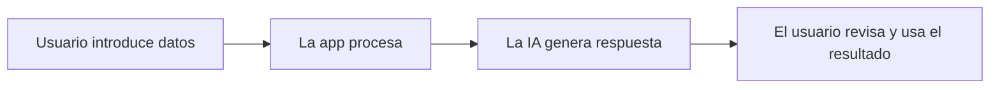

# Skill: Memoria de Proyecto IA — Informe Ejecutivo

## Objetivo

Generar una **Memoria de Proyecto + Informe Ejecutivo completo** que:

- Cubra las 9 fases principales del enunciado.
- Narre el proceso real: prompts usados, herramientas, decisiones e iteraciones.
- Incluya ejemplos concretos de inputs y outputs del prototipo.
- Sea comprensible para personas no técnicas.
- Tenga una extensión de 12-20 páginas A4 (4.600–8.000 palabras).
- Sea entregable como Markdown, HTML/CSS, DOCX, PDF o presentación.

**No usar este skill** para: ideas iniciales, lluvia de ideas, ayuda puntual con código, bugs, diseño de pantallas aisladas o mejora de prompts individuales.

---

# Paso 1 — Entrevista estructurada

Haz las preguntas en bloques. Si el alumno ya compartió información, extráela directamente sin repetir. Solo pregunta lo que falte.

## Bloque A — Problema y contexto
1. ¿Qué problema detectaste? ¿En qué empresa, entidad o entorno ocurre?
2. ¿Es un caso real o ficticio? ¿Tiene nombre?
3. ¿Cuándo aparece y con qué frecuencia? ¿A quién afecta más?

## Bloque B — Proceso y coste
4. ¿Qué proceso concreto quisiste mejorar? (citas, emails, fichas, presupuestos, atención al cliente…)
5. ¿Tienes algún dato de tiempo o coste? Puede ser estimado.
6. ¿Qué pasaría si no se resuelve?

## Bloque C — La solución
7. ¿Qué nombre le pusiste? ¿Qué introduce el usuario y qué recibe como resultado?
8. ¿Usaste Google Antigravity? ¿Dónde está publicado el prototipo?
9. ¿Qué herramientas técnicas usaste? (HTML, CSS, JS, GitHub Pages, APIs, Firebase, Supabase…)

## Bloque D — Proceso de trabajo *(bloque clave)*
10. ¿Qué prompts usaste? Pide que pegue alguno o que los resuma.
11. ¿En qué te inspiraste? ¿Viste algún ejemplo o referencia similar?
12. ¿Qué fue lo más difícil? ¿Qué tuviste que cambiar o repetir?
13. ¿Qué resultados obtuviste en las pruebas? (casos probados, aciertos, errores, tiempo ahorrado)

## Bloque E — Riesgos y entrega
14. ¿Qué riesgos identificaste al usar IA en este contexto?
15. ¿Cómo entregas el prototipo? (enlace web, GitHub, vídeo, capturas, ZIP…)
16. ¿Qué harías si tuvieras más tiempo?

## Bloque F — Formato
17. ¿Quieres el documento en Markdown o como web HTML+CSS?
18. Si es web, ¿qué estilo prefieres?
    - A. Claro, técnico y formal
    - B. Moderno, minimalista y visual, con color por sección
    - C. Elegante, corporativo y sobrio
    - D. "I Love Comic Sans" — informal y deliberadamente poco serio
19. ¿Quieres elementos gráficos? (tablas, diagramas Mermaid, cronograma, comparativas antes/después)

---

# Paso 1.5 — Diagnóstico de suficiencia

Antes de redactar, verifica que existen estos **datos críticos**. Si falta alguno, no redactes el informe completo.

| Dato | Nivel |
|---|---|
| Problema concreto | **Obligatorio** |
| Empresa/sector/entorno | **Obligatorio** |
| Usuario o stakeholder principal | **Obligatorio** |
| Tarea o flujo que se mejora | **Obligatorio** |
| Nombre y función de la app | **Obligatorio** |
| Qué introduce el usuario y qué recibe | **Obligatorio** |
| Ejemplo de input/output | **Obligatorio** |
| Casos de prueba y resultados mínimos | **Obligatorio** |
| Prompts reales o representativos | **Obligatorio** |
| Riesgos principales del uso de IA | **Obligatorio** |
| Enlace, capturas o descripción del prototipo | Recomendado |
| Herramientas técnicas usadas | Recomendado |
| Coste estimado del proceso actual | Recomendado |
| Inspiraciones o referencias consultadas | Recomendado |
| Mejoras futuras | Recomendado |

Si faltan datos no críticos, avanza usando **estimaciones marcadas claramente**.

> Ejemplo: "Si no tienes el dato exacto, puedo usar una estimación: 10 consultas semanales × 8 min × 15 €/hora. ¿Te encaja?"

**Regla de honestidad documental:** Distingue siempre entre dato aportado, dato estimado, prompt real, prompt reconstruido y suposición razonable. Nunca inventes resultados, herramientas, enlaces, decisiones, datos económicos o funcionalidades que el prototipo no tiene.

---

# Paso 2 — Criterios de evaluación académica

El informe debe demostrar:

- Identificación clara de un problema realista con KPI relacionado.
- Uso documentado de IA durante el desarrollo (prompts, iteraciones, decisiones).
- Evidencia de pruebas, ajustes y mejoras.
- Conciencia de riesgos, límites y necesidad de supervisión humana.
- Viabilidad mínima del prototipo.
- Explicación comprensible para una persona no técnica.

---

# Paso 3 — Estructura del informe

Genera el informe completo una vez tengas datos suficientes. Tono: profesional, claro y accesible. Sin jerga técnica sin explicar.

```md
# [Nombre del proyecto]
## Informe Ejecutivo — Proyecto Final IA

Alumno: [nombre] | Fecha: [fecha] | Herramientas: [lista]
Demo: [url] | Repositorio: [url]

---

## 1. Resumen ejecutivo
[3-5 líneas: qué problema aborda, qué solución propone, para quién y qué valor aporta.]

---

## 2. Descripción del problema

### 2.1 El problema
[Qué ocurre, dónde, con qué frecuencia y por qué supone una fricción.]

### 2.2 Stakeholders

| Stakeholder | Necesidad | Problema actual | Impacto |
|---|---|---|---|

### 2.3 Coste actual estimado

| Concepto | Valor | Fuente |
|---|---:|---|
| Volumen mensual de tareas | | dato real / estimación |
| Tiempo medio por tarea | | dato real / estimación |
| Coste/hora estimado | | dato real / estimación |
| Coste mensual | | cálculo |
| Coste anual | | cálculo |

### 2.4 Nuevos riesgos que podría generar la solución

| Posible problema | Causa | Medida preventiva |
|---|---|---|

---

## 3. Caso de uso y criterios de éxito

### 3.1 Caso de uso principal
[Quién usa la herramienta, qué necesita hacer, qué introduce y qué obtiene.]

### 3.2 Ejemplo de uso

**Input:** > [Ejemplo concreto]
**Output:** > [Resultado real o representativo]

### 3.3 KPIs

| KPI | Situación inicial | Meta | Cómo se mide |
|---|---:|---:|---|

---

## 4. Diseño de la solución — MVP

### 4.1 Descripción
[Qué es, qué hace y qué no hace todavía.]

### 4.2 Flujo de la aplicación



### 4.3 Pantallas principales

| Pantalla | Función | Usuario |
|---|---|---|

### 4.4 Herramientas utilizadas
[Lista explicada: Google Antigravity, HTML, CSS, JS, APIs, GitHub Pages…]

### 4.5 Estructura del prototipo
```txt
/proyecto
├── index.html
├── style.css
├── script.js
└── README.md
```

### 4.6 Limitaciones del MVP
[Qué no hace, qué requiere revisión humana, qué falta para producción.]

---

## 5. Proceso de construcción — PoC

### 5.1 Cómo se construyó
[Narración del proceso real: pasos, orden, evolución de la solución.]

> Ejemplo de tono: "Para construir el generador de fichas, se partió de un prompt base que pedía a la IA actuar como redactor cultural. El primer intento producía textos demasiado largos, por lo que se añadió la instrucción 'máximo 80 palabras'. La categorización automática se incorporó en una segunda iteración tras comprobar que el personal necesitaba etiquetar cada actividad manualmente."

### 5.2 Prompts utilizados

> [Prompt real o representativo]
> *(Si no es literal: "Prompt representativo reconstruido a partir del proceso descrito.")*

### 5.3 Inspiración y referencias
[En qué se inspiró el alumno, qué ejemplos o recursos consultó.]

### 5.4 Decisiones de diseño y dificultades
[Qué alternativas se descartaron y por qué. Qué no funcionó y cómo se resolvió.]

---

## 6. Evaluación y resultados

### 6.1 Casos de prueba

| Caso | Input | Esperado | Obtenido | Valoración |
|---|---|---|---|---|

### 6.2 Resultados

| Métrica | Antes | Después | Mejora |
|---|---:|---:|---:|
| Tiempo por tarea | | | |
| Errores detectados | | | |

### 6.3 Evaluación del KPI principal
[Si se cumplió el objetivo, en qué medida y con qué limitaciones.]

### 6.4 Ajustes realizados

| Problema detectado | Causa | Ajuste |
|---|---|---|

---

## 7. Responsabilidad y uso responsable de la IA

### 7.1 Riesgos

| Riesgo | Impacto | Medida de control |
|---|---|---|

### 7.2 Privacidad, supervisión humana y transparencia
[Qué datos maneja y cuáles no deben introducirse. Qué decisiones quedan siempre en manos humanas. Cómo se informa al usuario de que hay IA detrás.]

### 7.3 Límites de la solución
[Qué no debe hacer y en qué casos no debería usarse sin revisión.]

---

## 8. Plan de implantación y hoja de ruta

### 8.1 Pasos para llevar la solución a producción
[Lista ordenada de acciones necesarias.]

### 8.2 Hoja de ruta

| Fase | Acción | Objetivo |
|---|---|---|
| Semana 1 | | |
| Mes 1 | | |
| Mes 2 | | |

### 8.3 Mejoras futuras
[Funcionalidades que se añadirían en versiones posteriores.]

---

## 9. Entrega

| Componente | Descripción |
|---|---|
| Prototipo | [URL GitHub Pages / Netlify / Vercel] |
| Repositorio | [URL] |
| Material complementario | [Capturas, vídeo demo, presentación, anexos] |

---

## Conclusión
[3-5 líneas: qué demuestra el proyecto, qué valor tiene, qué aprendió el alumno y cuál es el siguiente paso lógico.]
```

---

# Paso 4 — Anexos opcionales

Incluye los que aporten valor real.

```md
## Anexo A — Prompts utilizados
## Anexo B — Capturas del prototipo
## Anexo C — Casos de prueba detallados
## Anexo D — Código o estructura del repositorio
## Anexo E — Decisiones de diseño
## Anexo F — Glosario
```

---

# Paso 5 — Formato de salida

| Formato | Características |
|---|---|
| **Markdown** | `.md` limpio con títulos, tablas, bloques de cita y diagramas Mermaid |
| **HTML/CSS** | Web completa, responsive, navegación por secciones, estilo según opción A/B/C/D |
| **DOCX** | Portada, índice, títulos jerárquicos, tablas limpias, saltos de página, anexos |
| **PDF** | Desde DOCX o HTML; portada, márgenes A4, tablas sin partir |
| **Presentación** | Solo si se pide expresamente; 8-12 diapositivas con las 9 secciones |

---

# Paso 6 — Archivo de resumen reutilizable

Genera siempre un archivo `resumen.md` con:

```md
# Resumen del proyecto

- Nombre: | Alumno: | Contexto: | Tipo: | Herramientas: | Demo: | Repo:

## Problema | Stakeholders | Solución | Proceso mejorado
## Prompts usados | Pruebas | Riesgos | Hoja de ruta
## Decisiones pendientes (datos que faltan o hay que confirmar)
```

---

# Paso 7 — Checklist final

Antes de entregar, verifica:

- [ ] Problema explicado en términos concretos
- [ ] Stakeholders identificados
- [ ] Proceso que se mejora claro
- [ ] Cálculo de coste actual (aunque sea estimado)
- [ ] KPIs medibles con metas numéricas
- [ ] Ejemplo real o representativo de uso
- [ ] Proceso de construcción narrado (no solo el resultado)
- [ ] Prompts reales o representativos incluidos
- [ ] Casos de prueba documentados
- [ ] Hechos, estimaciones y propuestas diferenciados
- [ ] Riesgos y límites reconocidos
- [ ] Hoja de ruta realista
- [ ] Sin promesas exageradas sobre la IA
- [ ] Comprensible para una persona no técnica
- [ ] Formato coincide con lo pedido
- [ ] `resumen.md` generado

---

# Paso 8 — Instrucción final al alumno

Al entregar, indica brevemente: formato generado, qué datos se usaron como estimación, qué partes conviene revisar antes de entregar y qué archivos se incluyen. Sin extenderse: el foco está en el documento final.